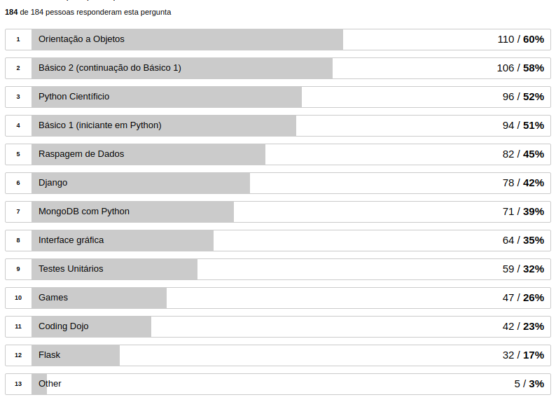
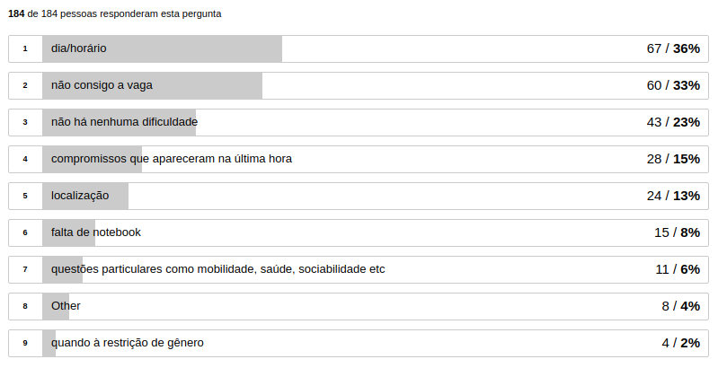
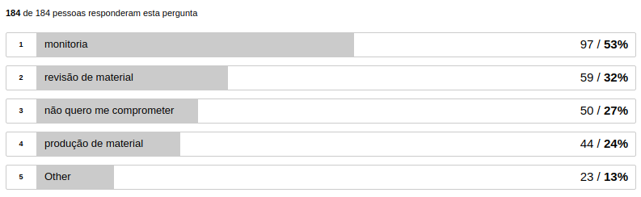
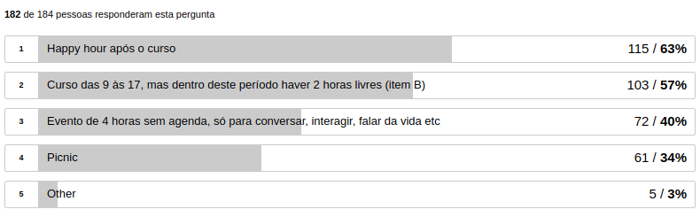

# PYLADIES SÃO PAULO

## Pesquisa - Planejamento 2018

---

## Resumo

- Divulgação em redes sociais PLSP
- 184 respostas de mais de 400 acessos à pesquisa
- 8 questões, 1 questão aberta para sugestões

---

## Resultados

---

#### O que querem aprender?

---

#### O que dificulta a participação nos eventos do PyLadies São Paulo?

---

#### Como gostariam de contribuir?

---

#### O que querem ensinar ou como podem colaborar
##### (produzindo ou revisando material, monitoria etc)

---?image=results/colaboracao.png&size=auto 90%

---

#### Para nos conhecermos melhor:

---

